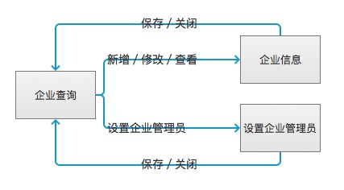
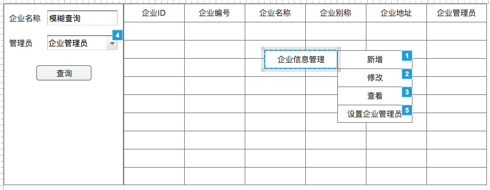
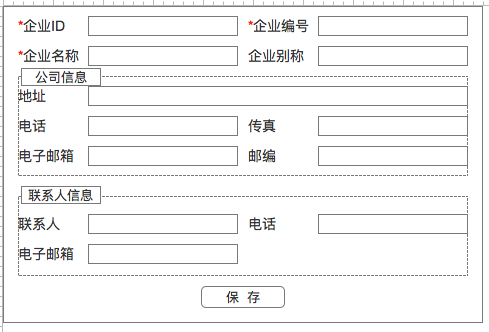
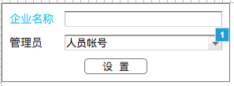

# 企业管理
- **功能：** 用于管理企业相关信息
- **使用角色：** 平台管理员、平台运营人员

## 1、流程图


## 2、模块详细设计

### 2.1、企业查询模块
使用查询配置出来对应界面

#### 2.1.1、界面


图1-1

#### 2.1.2、业务规则

##### 条件元素
|名称|是否必填|查询类型|字段|备注|
|---|:-----:|:-----:|---|---|
|企业名称|否|模糊查询|bg_name||
|管理员|否|精确查询|admin_person_id|动态对象——企业管理员——CODELABEL2ID|

##### SQL:
```
SELECT
  tb.bg_id    AS bgId,
  tb.bg_no    AS bgNo,
  tb.bg_name  AS bgName,
  tb.known_as AS knownAs,
  tb.address,
  vu.nickname
FROM tzpf_bg tb LEFT JOIN v3_user vu ON (vu.person_id = tb.admin_person_id)
WHERE ${bgName} AND ${personId}
```

##### 字段元素
|字段|名称|
|:---:|:---:|
|bgId|企业ID|
|bgNo|企业编号|
|bgName|企业名称|
|knownAs|企业别称|
|address|企业地址|
|nickname|企业管理员|

##### 右击菜单逻辑
|菜单|操作逻辑|
|:---:|-----|
|新增|打开企业信息页面，页面内容为空|
|修改|打开企业信息页面，依据选中的企业ID查询出对于信息并填入对于field中|
|查看|打开企业信息页面，依据选中的企业ID查询出对于信息并填入对于field中|
|设置企业管理员|打开设置企业管理员界面，依据选中的企业ID查询出企业名称和管理员ID|

### 2.2、企业信息模块
企业信息界面，操作新增、修改、查询。数据表为tzpf_bg

#### 2.2.1、界面


图2-1

#### 2.2.2、业务规则

##### 图2-1界面元素
|名称|字段|
|:---:|:---:|
|企业ID|bg_id|
|企业编号|bg_no|
|企业名称|bg_name|
|企业别称|known_as|
|地址|address|
|电话（公司信息）|tel|
|传真|fax|
|电子邮箱（公司信息）|email|
|联系人|linkman|
|电话（联系人信息）|linkman_tel|
|电子邮箱（联系人信息）|linkman_email|

##### 界面逻辑
|规则|描述|
|---|---|
|新增逻辑|无特殊要求|
|修改逻辑|企业ID不可编辑，把DB_VERSION带到前台，保存时提交后台校验DB_VERSION并自动更新|
|查看逻辑|不可编辑，保存按钮不可点击|
|保存逻辑|必填和校验见对应逻辑，保存信息保存到tzpf_bg中，加上create、modified、dbversion信息|
|必填项|企业ID、企业编号、企业名称|
|校验项|公司信息下的电话、电子邮箱、邮编；联系人信息下的电话、电子邮箱。电话校验可以是手机也可以座机（这个会比较难），电子邮箱就是校验其格式，邮编就是6位数|
|保存错误|提示错误信息|
|保存正确|提示保存成功，点击确定后关闭窗口，并刷新外面的查询|
|关闭逻辑|关闭窗口|

### 2.3、设置企业管理员界面

#### 2.3.1、界面


图3-1

#### 2.3.2、业务规则

##### 图3-1界面元素
|名称|字段|备注
|:---:|:---:|---|
|企业名称|bg_name||
|管理员|admin_person_id|动态对象——人员帐号——CODELABEL2ID|

##### 界面逻辑
|规则|描述|
|:---:|---|
|打开|依据bgId从数据库中获取到bg_name和admin_person_id，并填入对应的field内|
|选择管理员|动态对象的选择，展现：[employeeNumber]nickname，提交：personId|
|设置|提交bgId和adminPersonId，依据bgId修改对应adminPersonId，并需要把其保存到日志表tzpf_bg_admin_change_log|
|设置错误|提示错误信息|
|设置正确|提示设置成功，点击确定后关闭窗口，并刷新外面的查询|
|关闭逻辑|关闭窗口|
