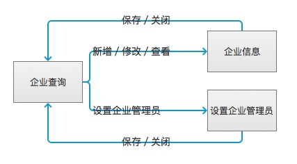
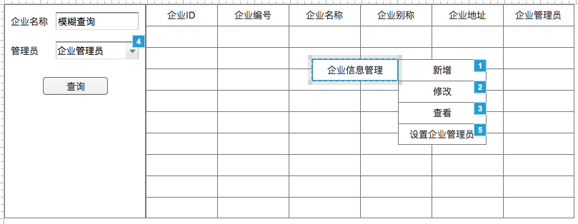

# 企业管理
## 1、流程图


## 2、模块详细设计

### 2.1、企业查询模块

#### 2.1.1、界面

图1-1

#### 2.1.2、业务规则
##### 条件元素

|名称|是否必填|查询类型|字段|
|---|:-----:|:-----:|-------|
|企业名称|否|模糊查询|bg_name|
|管理员|否|精确查询|admin_person_id|

##### SQL:
```
SELECT
  tb.bg_id    AS bgId,
  tb.bg_no    AS bgNo,
  tb.bg_name  AS bgName,
  tb.known_as AS knowAs,
  tb.address,
  vu.nickname
FROM tzpf_bg tb LEFT JOIN v3_user vu ON (vu.person_id = tb.admin_person_id)
WHERE tb.bg_name LIKE ${bgName} AND tb.admin_person_id = ${personId}
```