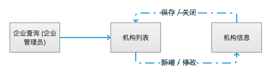
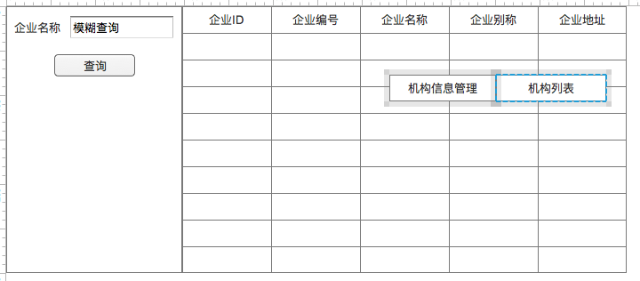
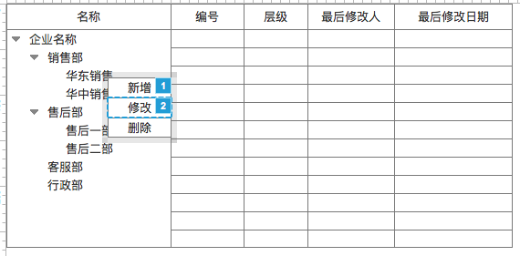
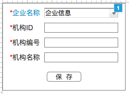

# 机构管理
- **功能：** 用于管理企业下机构的相关信息
- **使用角色：** 企业管理员

## 1、流程图


## 2、模块详细设计

### 2.1、企业查询模块
使用查询配置出来对应界面

#### 2.1.1、界面


图1-1

#### 2.1.2、业务规则

##### 条件元素
|名称|是否必填|查询类型|字段|
|---|:-----:|:-----:|---|
|企业名称|否|模糊查询|bg_name|

##### SQL:
```
SELECT
  tb.bg_id    AS bgId,
  tb.bg_no    AS bgNo,
  tb.bg_name  AS bgName,
  tb.known_as AS knownAs,
  tb.address
FROM tzpf_bg tb
WHERE tb.admin_person_id = ${session_person_id} AND ${bgName} 
```

##### 字段元素
|字段|名称|
|:---:|:---:|
|bgId|企业ID|
|bgNo|企业编号|
|bgName|企业名称|
|knownAs|企业别称|
|address|企业地址|

##### 右击菜单逻辑
|菜单|操作逻辑|
|:---:|-----|
|机构列表|打开机构列表页面|

### 2.2、机构信息模块
企业下机构信息界面，可以查看机构树，新增机构，修改机构，删除机构，更改机构位置。数据表为tzpf_org

#### 2.2.1、界面


图2-1



图2-2

#### 2.2.2、业务规则

##### 图2-1字段元素
>把tzpf_org表的数据，构建成树形展现，需要的数据如下

|字段|名称|备注|
|:---:|:---:|---|
|id|id|隐藏|
|orgName|机构名称|text|
|isLeaf|是否叶子|用于extjs树展现，隐藏|
|orgCode|机构编号||
|level|层级||
|lastModifiedBy|最后修改人||
|lastModifiedDate|最后修改日期||

##### 图2-1页面逻辑
|规则|描述|
|---|---|
|打开|url中有参数bgId，获取企业名称|
|展开根|向后台一次性获取所有机构的目录树，把后台的tzpf_org的数据构建成一个树形数据结构|
|新增|可以在任意节点，选中节点做为其父节点，点击后打开机构信息界面（同一个app 下）|
|修改|可以在除了根节点之外的任意节点，选中节点就是要修改的机构，点击后打开机构信息界面（同一个app 下）|
|删除|可以在除了根节点之外的任意节点，弹出提醒对话框，提醒操作人员“是否删除该机构及其子机构”|
|取消删除|关闭提醒窗口|
|确认删除|删除该ID的机构，及其它的子机构|
|拖拽节点|可以拖拽除了根节点之外所有节点到除了其子节点外的任意节点下，level不可大于9，否则提醒失败，并告知原因|

##### 图2-2界面元素
|名称|字段|备注
|:---:|:---:|---|
|企业名称|bg_id|动态对象——企业信息——CODELABEL2ID|
|机构ID|org_id||
|机构编号|org_code||
|机构名称|org_name||

##### 图2-2界面逻辑
|规则|描述|
|---|---|
|隐藏字段|用于方便后期处理的，ID、PARENT_ORG_ID和DB_VERSION|
|新增逻辑|企业名称是动态对象，依据参数bgId来，还有参数PARENT_ORG_ID|
|修改逻辑|依据参数ID从后台获取最新该机构数据，保存时提交ID、ORG_CODE、ORG_NAME和DB_VERSION，后台校验DB_VERSION并自动更新|
|保存逻辑|保存信息保存到tzpf_org中，加上create、modified、dbversion信息|
|保存错误|提示错误信息|
|保存正确|提示保存成功，点击确定后关闭窗口，并刷新机构列表树|
|关闭逻辑|关闭窗口|