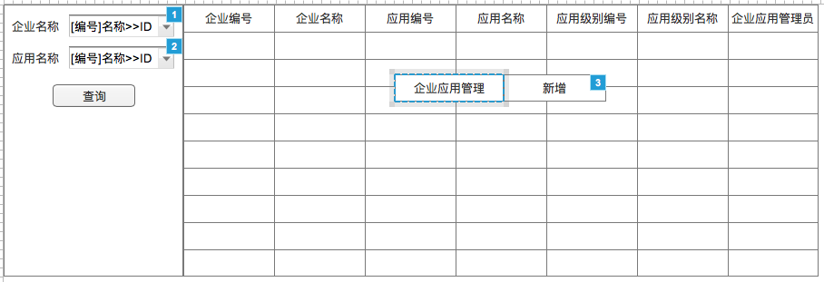
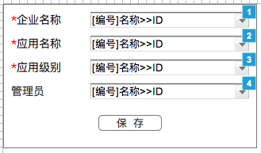

# 企业应用管理
- **功能：** 让平台管理员用于查看所有企业应用列表，并可以在其中进行新增企业应用操作
- **使用角色：** 平台管理员
- **Axure指向：** 1.4 企业应用查询

## 1、流程图


## 2、模块详细设计

### 2.1、企业应用查询模块
使用查询配置出相应界面

#### 2.1.1、界面


#### 2.1.2、查询配置
**条件元素**

|ID|名称|是否必填|查询类型|字段|备注|
|---|---|:-----:|:-----:|---|---|
|bgId|企业名称|否|精准查询|tb.bg_id|动态对象——[企业信息(PA)](dynobj/企业信息(PA).md)——CODELABEL2ID|
|appId|应用名称|否|精确查询|tah.app_id|动态对象——[应用信息(PA)](dynobj/应用信息(PA).md)——CODELABEL2ID|

**SQL**

```
SELECT
  teh.erp_id        AS erpId,--企业应用ID  隐藏
  tb.bg_no          AS bgNo,--企业编号
  tb.bg_name        AS bgName,--企业名称
  tah.app_no        AS appNo,--应用编号
  tah.app_loc_name  AS appName,--应用名称
  tal.level_no      AS levelNo,--应用级别编号
  tal.level_name    AS levelName,--应用级别名称
  vu.nickname--企业应用管理员
FROM tzpf_bg tb
  INNER JOIN tzpf_erp_header teh ON (teh.user_type = '1' AND teh.user_id = tb.bg_id)
  INNER JOIN tzpf_app_header tah ON (tah.app_status = '1' AND tah.app_id = teh.app_id)
  INNER JOIN tzpf_app_level tal ON (tal.level_id = teh.level_id)
  LEFT JOIN v3_user vu ON (vu.person_id = teh.admin_person_id)
WHERE ${bgId} AND ${appId}
ORDER BY tb.bg_no, tah.app_no, tal.level_no;
```

**字段元素**

|字段|名称|hidden|
|:---:|:---:|:---:|
|bgNo|企业编号|false|
|bgName|企业名称|false|
|appNo|应用编号|false|
|appName|应用名称|false|
|levelNo|应用级别编号|false|
|levelName|应用级别名称|false|
|nickname|企业应用管理员|false|

**右击菜单逻辑**

|菜单|操作逻辑|
|:---:|-----|
|企业应用管理-新增|打开企业应用信息界面|

### 2.2、企业应用信息
用于新增企业应用

#### 2.2.1、界面


**界面元素**

|名称|字段|备注|
|:---:|:---:|---|
|企业名称|bgId|必填，动态对象——[企业信息(PA)](dynobj/企业信息(PA).md)——CODELABEL2ID|
|应用名称|appId|必填，动态对象——[应用信息(PA)](dynobj/应用信息(PA).md)——CODELABEL2ID|
|应用级别|levelId|必填，动态对象——[应用级别_appId](dynobj/应用级别_appId.md)——CODELABEL2ID|
|管理员|adminPersonId|动态对象——[人员账号_bgId](dynobj/人员账号_bgId.md)——CODELABEL2ID|

**界面逻辑**

|规则|描述|
|:---:|---|
|打开|一个初始化的界面，不需要数据|
|选择企业|动态对象的选择，展现[code]name，提交bgId。改变值后，修改管理员动态对象的bgId参数|
|选择应用|动态对象的选择，展现[code]name，提交appId。改变值后，修改应用级别动态对象的appId参数|
|选择应用级别|动态对象的选择，展现[code]name，提交levelId|
|选择管理员|动态对象的选择，展现：[code]name，提交：adminPersonId|
|保存|提交bgId、appId、levelId和adminPersonId，[p-保存企业应用信息](#p-保存企业应用信息)|
|保存正确|提示"保存成功！"，点击确定后关闭窗口，并刷新外面的查询|
|保存错误|提示错误信息|
|关闭逻辑|关闭窗口|

#### 2.2.2、数据逻辑
|序号|逻辑名称|
|:---:|---|
|1|[p-保存企业应用信息](#p-保存企业应用信息)|

* * * * * * * * * *

#### p-保存企业应用信息
**参数**

|code|source|name|type|remark|
|---|:---:|---|:---:|---|
|bgId|param|企业ID|String| |
|appId|param|应用ID|String| |
|levelId|param|应用级别ID|String| |
|adminPersonId|param|管理员ID|String|可以为空|

**逻辑**  
判断(bgId)(tzpf_bg)、(appId、levelId)(tzpf_app_level)、(adminpersonId)(v3_user)是否存在，不存在抛出业务异常。  
新建TzpfErpHeader对象，赋值erpId(uuid)，userType(1)，userId(bgId)，appId(appId)，levelId(levelId)，applyType(1)，
startDate(now)，adminPersonId(adminPersonId)。把对象保存进数据库。

**返回**  
RSResponse.SUCCESS

* * * * * * * * * *