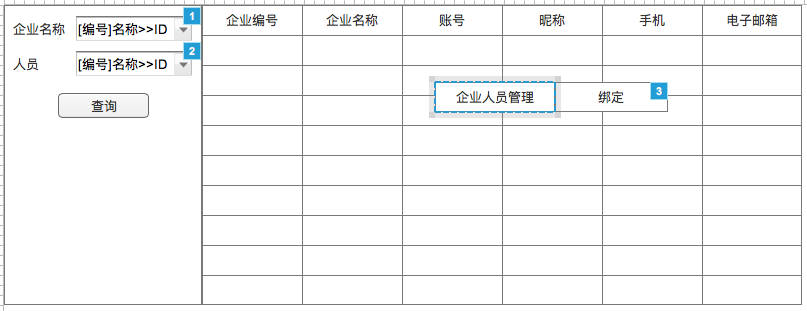
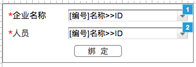

# 企业人员管理
- **功能：** 让平台管理员查看所有企业人员列表，并可以在上面进行企业和人员之间的绑定
- **使用角色：** 平台管理员
- **Axure指向：** 1.5 企业人员查询

## 1、流程图


## 2、模块详细设计

### 2.1、企业人员查询模块
使用查询配置出相应界面

#### 2.1.1、界面


#### 2.1.2、查询配置
**条件元素**

|ID|名称|是否必填|查询类型|字段|备注|
|---|---|:-----:|:-----:|---|---|
|bgId|企业名称|否|精准查询|tb.bg_id|动态对象——[企业信息(PA)](dynobj/企业信息(PA).md)——CODELABEL2ID|
|personId|人员|否|精确查询|vu.person_id|动态对象——[人员账号](dynobj/人员账号.md)——CODELABEL2ID|

**SQL**

```
SELECT
  tb.bg_no            AS bgNo, --企业编号
  tb.bg_name          AS bgName, --企业名称
  vu.employee_number  AS employeeNumber, --账号
  vu.nickname, --昵称
  vu.mobile_phone     AS mobilePhone, --手机
  vu.email_address    AS emailAddress --电子邮箱
FROM tzpf_bg_person tbp, tzpf_bg tb, v3_user vu
WHERE tbp.bg_id = tb.bg_id
      AND tbp.person_id = vu.person_id
      AND ${bgId} AND ${personId}
ORDER BY bgNo, employeeNumber;
```
_注意：_ 分页查询，每页100行


**字段元素**

|字段|名称|hidden|
|:---:|:---:|:---:|
|bgNo|企业编号|false|
|bgName|企业名称|false|
|employeeNumber|账号|false|
|nickname|昵称|false|
|mobilePhone|手机|false|
|emailAddress|电子邮箱|false|

**右击菜单逻辑**

|菜单|操作逻辑|
|:---:|-----|
|企业人员管理-绑定|打开[企业人员绑定](#22企业人员绑定)|

### 2.2、企业人员绑定
用于把现有账号和人员进行绑定

#### 2.2.1、界面


**界面元素**

|名称|字段|备注|
|:---:|:---:|---|
|企业名称|bgId|动态对象——[企业信息(PA)](dynobj/企业信息(PA).md)——CODELABEL2ID|
|人员|personId|动态对象——[人员账号](dynobj/人员账号.md)——CODELABEL2ID|

**界面逻辑**

|规则|描述|
|:---:|---|
|打开|一个初始化的界面，不需要数据|
|选择企业|动态对象的选择，展现[code]name，提交bgId。改变值后，修改管理员动态对象的bgId参数|
|选择人员|动态对象的选择，展现：[code]name，提交：personId|
|绑定|提交bgId和personId，[p-绑定企业人员](#p-绑定企业人员)|
|绑定正确|提示"绑定成功！"，点击确定后关闭窗口，并刷新外面的查询|
|绑定错误|提示错误信息|
|关闭逻辑|关闭窗口|

#### 2.2.2、数据逻辑
|序号|逻辑名称|
|:---:|---|
|1|[p-绑定企业人员](#p-绑定企业人员)|

* * * * * * * * * *

#### p-绑定企业人员
**参数**

|code|source|name|type|remark|
|---|:---:|---|:---:|---|
|bgId|param|企业ID|String| |
|personId|param|人员ID|String| |

**逻辑**  
判断(bgId)(tzpf_bg)、(personId)(v3_user)是否存在，不存在抛出业务异常。  
新建TzpfBgPerson对象，赋值bgId(bgId)，personId(personId)，beginDate(now())，status(1)。把对象保存进数据库。

**返回**  
RSResponse.SUCCESS

* * * * * * * * * *