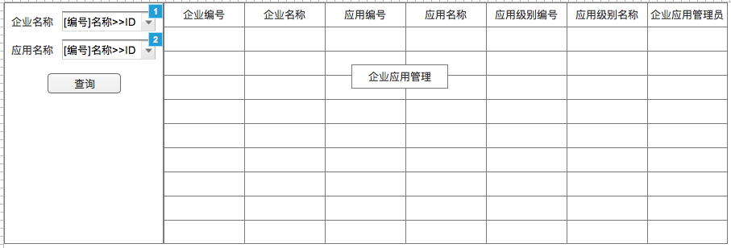
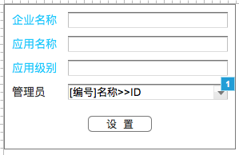

# 企业应用管理
- **功能：** 让企业管理员用于管理企业应用相关信息，现阶段只是用于企业应用管理员的设置
- **使用角色：** 企业管理员
- **Axure指向：** 2.2 企业应用查询

## 1、流程图


## 2、模块详细设计

### 2.1、企业应用查询模块
使用查询配置出相应界面

#### 2.1.1、界面


#### 2.1.2、查询配置
**条件元素**

|ID|名称|是否必填|查询类型|字段|备注|
|---|---|:-----:|:-----:|---|---|
|bgId|企业名称|否|精准查询|tb.bg_id|动态对象——[企业信息(BA)](dynobj/企业信息(BA).md)——CODELABEL2ID|
|appId|应用名称|否|精确查询|tah.app_id|动态对象——[应用信息(BA)](dynobj/应用信息(BA).md)——CODELABEL2ID|

**SQL**

```
SELECT
  teh.erp_id        AS erpId,--企业应用ID  隐藏
  tb.bg_no          AS bgNo,--企业编号
  tb.bg_name        AS bgName,--企业名称
  tah.app_no        AS appNo,--应用编号
  tah.app_loc_name  AS appName,--应用名称
  tal.level_no      AS levelNo,--应用级别编号
  tal.level_name    AS levelName,--应用级别名称
  vu.nickname--企业应用管理员
FROM tzpf_bg tb
  INNER JOIN tzpf_erp_header teh ON (teh.user_type = '1' AND teh.user_id = tb.bg_id)
  INNER JOIN tzpf_app_header tah ON (tah.app_status = '1' AND tah.app_id = teh.app_id)
  INNER JOIN tzpf_app_level tal ON (tal.level_id = teh.level_id)
  LEFT JOIN v3_user vu ON (vu.person_id = teh.admin_person_id)
WHERE tb.admin_person_id = ${session_personId} AND ${bgId} AND ${appId}
ORDER BY tb.bg_no, tah.app_no, tal.level_no;
```

**字段元素**

|字段|名称|hidden|
|:---:|:---:|:---:|
|erpId|企业应用ID|true|
|bgNo|企业编号|false|
|bgName|企业名称|false|
|appNo|应用编号|false|
|appName|应用名称|false|
|levelNo|应用级别编号|false|
|levelName|应用级别名称|false|
|nickname|企业应用管理员|false|

**右击菜单逻辑**

|菜单|操作逻辑|
|:---:|-----|
|设置企业应用管理员|打开[设置企业应用管理员](#22设置企业应用管理员)，传输条件erpId|

### 2.2、设置企业应用管理员
主键为erpId，所有的操作以erpId进行贯穿

#### 2.2.1、界面


**界面元素**

|名称|字段|备注|
|:---:|:---:|---|
|企业名称|bgName| |
|应用名称|appName| |
|应用级别|levelName| |
|管理员|adminPersonId|动态对象——[人员账号_bgId](dynobj/人员账号_bgId.md)——CODELABEL2ID|

**界面逻辑**

|规则|描述|
|:---:|---|
|打开|将[p-打开设置企业应用管理员界面](#p-打开设置企业应用管理员界面)返回的model数据填入对应的field内，同时将bgId设置到管理员的动态对象参数中|
|选择管理员|动态对象的选择，展现：[employeeNumber]nickname，提交：personId|
|设置|提交erpId和adminPersonId，[p-设置企业应用管理员](#p-设置企业应用管理员)|
|设置错误|提示错误信息|
|设置正确|提示"设置成功"，点击确定后关闭窗口，并刷新外面的查询|
|关闭逻辑|关闭窗口|

#### 2.2.2、数据逻辑
|序号|逻辑名称|
|:---:|---|
|1|[p-打开设置企业应用管理员界面](#p-打开设置企业应用管理员界面)|
|2|[p-设置企业应用管理员](#p-设置企业应用管理员)|

* * * * * * * * * *

##### p-打开设置企业应用管理员界面
**参数**

|code|source|name|type|
|---|:---:|---|:---:|
|erpId|path|企业应用ID|String|

**逻辑**

依据erpId，从数据库获取bgId(tzpf_bg)、bgName(tzpf_bg)、appName(tzpf_app_header)、levelName(tzpf_app_level)、
adminPersonId(tzpf_erp_header)，把这些数据放入model中返回给前台。

**返回**

```json
{
  "erpId": "",
  "bgId": "",
  "bgName": "",
  "appName": "",
  "levelName": "",
  "adminPersonId": ""
}
```

* * * * * * * * * *

##### p-设置企业应用管理员
**参数**

|code|source|name|type|
|---|:---:|---|:---:|
|erpId|param|企业应用ID|String|
|adminPersonId|param|管理员ID|String|
|operator|session|操作人员ID|String|

**逻辑**
判断erpId(tzpf_erp_header)、adminPersonId(v3_user)是否存在，不存在抛出业务异常。
依据erpId，获取对应的JPA对象TzpfErpHeader，把里面的adminPersonId的值保存为oriAdminPersonId（为空的话就存中文字"空"），然后把其设成参数中传入的。  
用erpId、oriAdminPersonId、adminPersonId、operator创建对象TzpfErpAdminLog（其它字段补齐）存入数据库。

**返回**

RSResponse.SUCCESS

* * * * * * * * * *