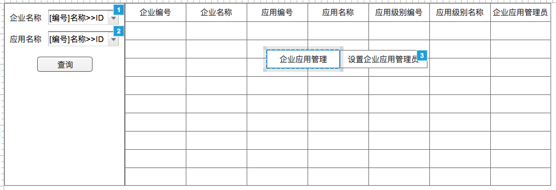
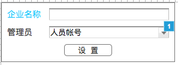

# 企业应用管理
- **功能：** 用于管理企业应用相关信息，现阶段只是用于企业应用管理员的设置
- **使用角色：** 企业管理员

## 1、流程图


## 2、模块详细设计

### 2.1、企业应用查询模块
使用查询配置出相应界面

#### 2.1.1、界面


#### 2.1.2、业务规则

##### 条件元素
|名称|是否必填|查询类型|字段|备注|
|---|:-----:|:-----:|---|---|
|企业名称|否|精准查询|bg_id|动态对象——企业信息(BA)——CODELABEL2ID|
|应用名称|否|精确查询|app_id|动态对象——应用信息(BA)——CODELABEL2ID|

##### SQL:
```
SELECT
  teh.erp_id        AS erpId,--企业应用ID  隐藏
  tb.bg_no          AS bgNo,--企业编号
  tb.bg_name        AS bgName,--企业名称
  tah.app_no        AS appNo,--应用编号
  tah.app_loc_name  AS appName,--应用名称
  tal.level_no      AS levelNo,--应用级别编号
  tal.level_name    AS levelName,--应用级别名称
  vu.nickname--企业应用管理员
FROM tzpf_bg tb
  INNER JOIN tzpf_erp_header teh ON (teh.user_type = '1' AND teh.user_id = tb.bg_id)
  INNER JOIN tzpf_app_header tah ON (tah.app_status = '1' AND tah.app_id = teh.app_id)
  INNER JOIN tzpf_app_level tal ON (tal.app_id = tah.app_id AND tal.level_id = teh.level_id)
  LEFT JOIN v3_user vu ON (vu.person_id = teh.admin_person_id)
WHERE tb.admin_person_id = ${session_personId} AND ${bgId} AND ${appId}
ORDER BY tb.bg_no, tah.app_no, tal.level_no;
```

##### 字段元素
|字段|名称|隐藏|
|:---:|:---:|:---:|
|bgId|企业应用ID|是|
|bgNo|企业编号|否|
|bgName|企业名称|否|
|appNo|应用编号|否|
|appName|应用名称|否|
|levelNo|应用级别编号|否|
|levelName|应用级别名称|否|
|nickname|企业应用管理员|否|

##### 右击菜单逻辑
|菜单|操作逻辑|
|:---:|-----|
|设置企业应用管理员|打开设置企业应用管理员界面，传输条件erpId|

### 2.2、设置企业应用管理员界面

#### 2.3.1、界面


图3-1

#### 2.3.2、业务规则

##### 图3-1界面元素
|名称|字段|备注
|:---:|:---:|---|
|企业名称|bg_name||
|管理员|admin_person_id|动态对象——人员帐号——CODELABEL2ID|

##### 界面逻辑
|规则|描述|
|:---:|---|
|打开|依据bgId从数据库中获取到bg_name和admin_person_id，并填入对应的field内|
|选择管理员|动态对象的选择，展现：[employeeNumber]nickname，提交：personId|
|设置|提交bgId和adminPersonId，依据bgId修改对应adminPersonId，并需要把其保存到日志表tzpf_bg_admin_change_log|
|设置错误|提示错误信息|
|设置正确|提示设置成功，点击确定后关闭窗口，并刷新外面的查询|
|关闭逻辑|关闭窗口|