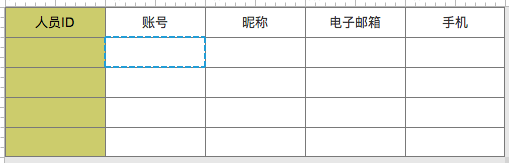

# 人员账号
- **功能：** 用于人员信息查询和展现，无权限控制

## 1、界面


注：墨绿色为隐藏字段

## 2、SQL：
```
SELECT
  vu.person_id       AS personId,
  --ID,  searchKey,  隐藏
  vu.employee_number AS employeeNumber,
  --CODE,  searchKey
  vu.nickname,
  --LABEL
  vu.email_address   AS emailAddress,
  --searchKey
  vu.mobile_phone    AS mobilePhone
  --searchKey
FROM v3_user vu
ORDER BY employeeNumber;
```

## 3、字段元素
|字段|名称|key|search|hidden|
|---|---|:---:|:---:|:---:|
|personId|人员ID|ID|true|true|
|employeeNumber|账号|CODE|true|false|
|nickname|昵称|LABEL|true|false|
|emailAddress|电子邮箱| |true|false|
|mobilePhone|手机| |true|false|


