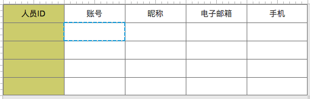

# 企业信息(BA)
- **功能：** 用于人员信息查询和展现，需要bgId作为查询条件传入

## 1、界面


注：墨绿色为隐藏字段

## 2、SQL：
```
SELECT
  vu.person_id       AS personId,
  vu.employee_number AS employeeNumber,
  vu.nickname,
  vu.email_address   AS emailAddress,
  vu.mobile_phone    AS mobilePhone
FROM v3_user vu, tzpf_bg_person tbp
WHERE vu.person_id = tbp.person_id
      AND tbp.bg_id = ${bgId}
ORDER BY vu.employee_number;
```

## 3、字段元素
|字段|名称|key|search|hidden|
|---|---|:---:|:---:|:---:|
|personId|人员ID|ID|true|true|
|employeeNumber|账号|CODE|true|false|
|nickname|昵称|LABEL|true|false|
|emailAddress|电子邮箱| |true|false|
|mobilePhone|手机| |true|false|


