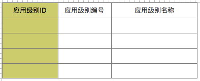

# 应用级别_appId
- **功能：** 用于查询和展现在某个应用下的所有应用级别，需要appId作为查询条件传入

## 1、界面


注：墨绿色为隐藏字段

## 2、SQL：
```
SELECT
  tal.level_id   AS levelId,
  tal.level_no   AS levelNo,
   tal.level_name AS levelName 
FROM tzpf_app_level tal
WHERE tal.app_id = ${appId}
ORDER BY tal.level_no;
```

## 3、字段元素
|字段|名称|key|search|hidden|
|---|---|:---:|:---:|:---:|
|levelId|应用级别ID|ID|true|true|
|levelNo|应用级别编号|CODE|true|false|
|levelName|应用级别名称|LABEL|false|false|


